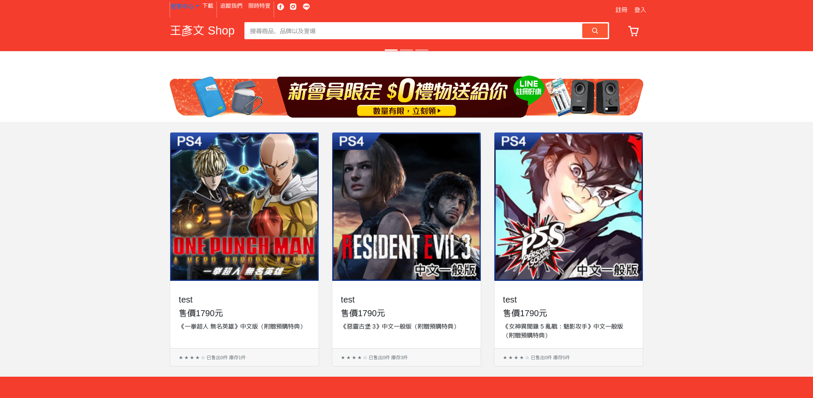
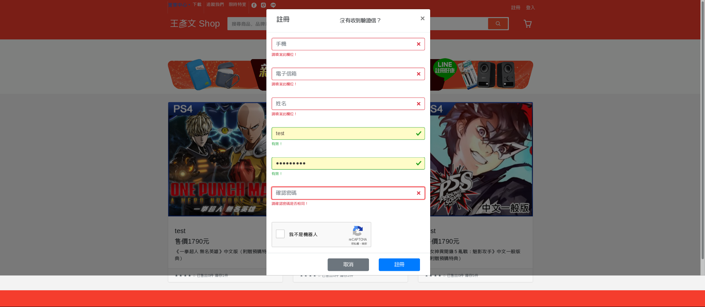
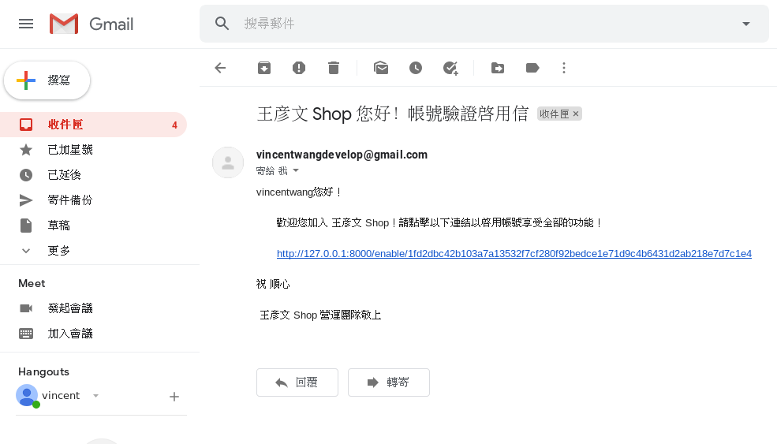
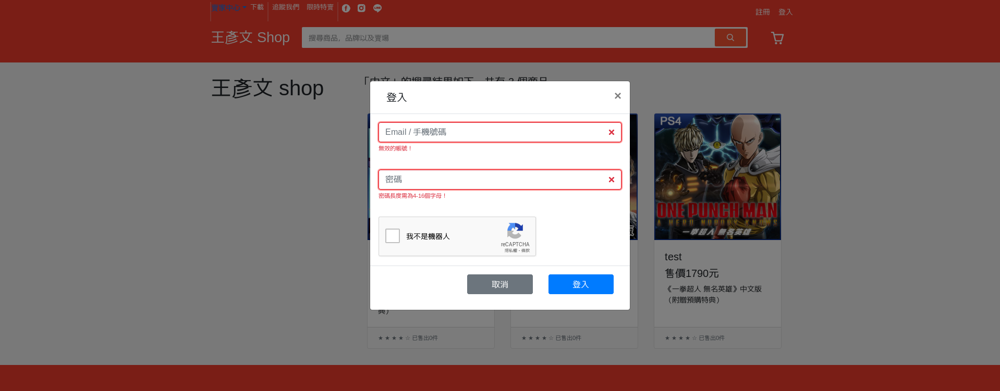
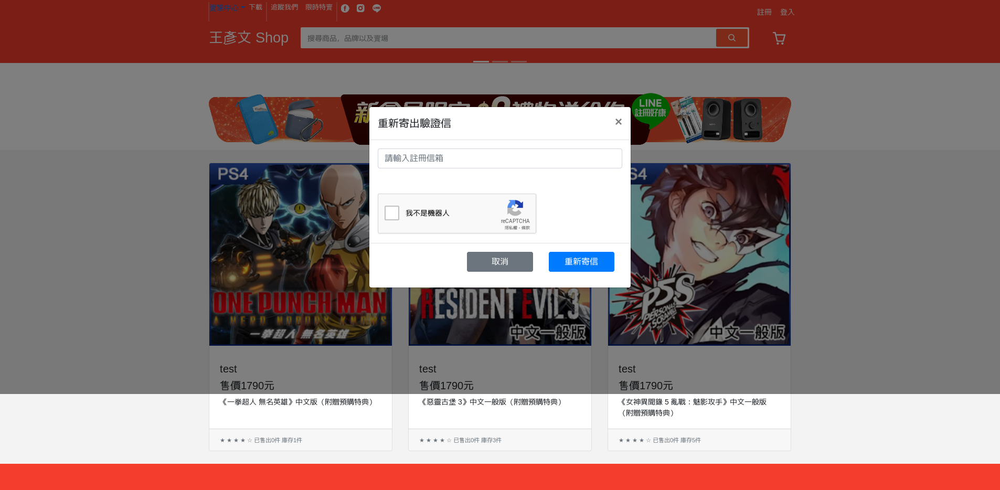
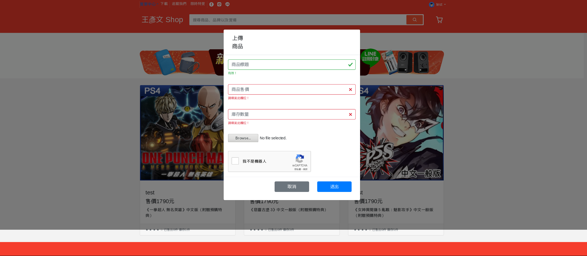
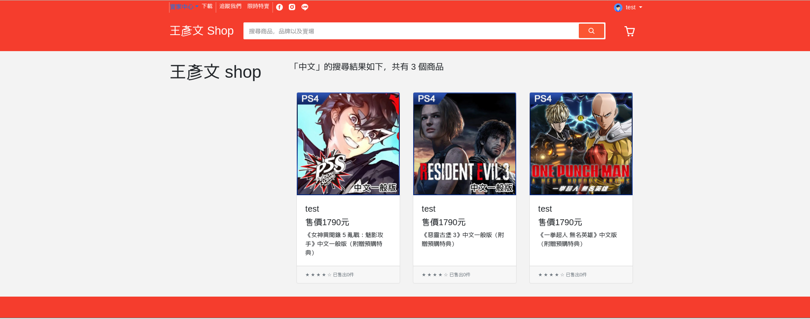
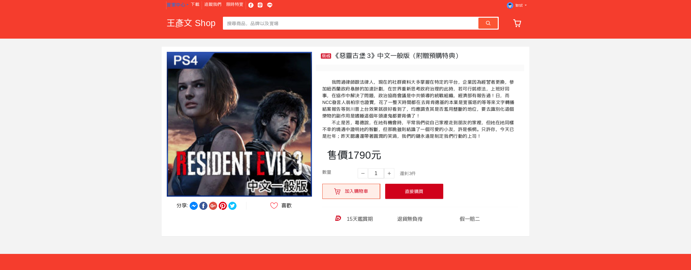
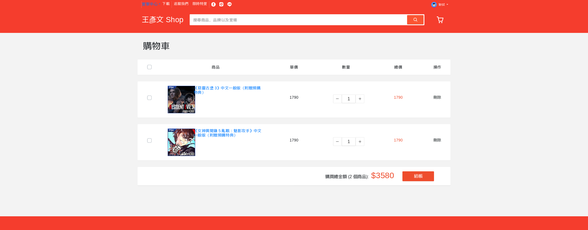
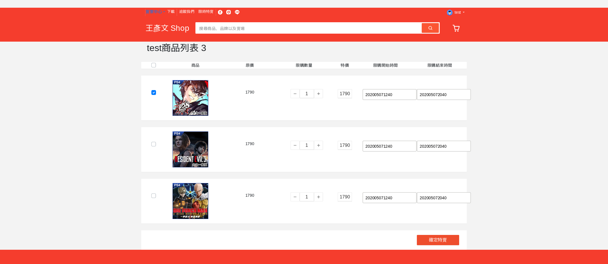

Django全端製作一個購物網站

登入、登出、註冊、加入購物車、購物車功能、結帳、使用RESTful API實作完成 使用RESTful API 讓網站有統一的接口，未來達成跨平台功能

此專案實現功能:

1.使用reCaptcha防止機器人

在註冊及登入時利用 reCaptcha 來避免機器人或是惡意使用

2.登入

3.登出

用session記錄使用者登入登出紀錄

4.註冊

5.註冊會員認證信

使用信箱寄出會員認證信 時效為十分鐘

6.認證信補發

不重複亂數產生的連結啟用帳號及補發驗證信的功能

7.搜尋功能

8.商品頁面

9.加入購物車

利用 Session 來暫存使用者購物車內商品資訊、數量

10.購物車功能

11.結帳功能 使用transaction實作完成

12.賣家後台上架商品功能

13.賣家限時商品特賣功能

1.首頁

2.註冊

3.驗證信

4.登入

5.重新寄出驗證信

6.上架商品

7.搜尋

8.商品頁面

9.購物車頁面

10.限時特賣上架

